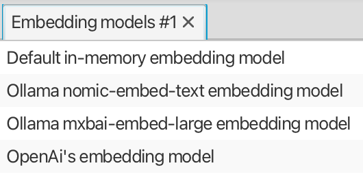
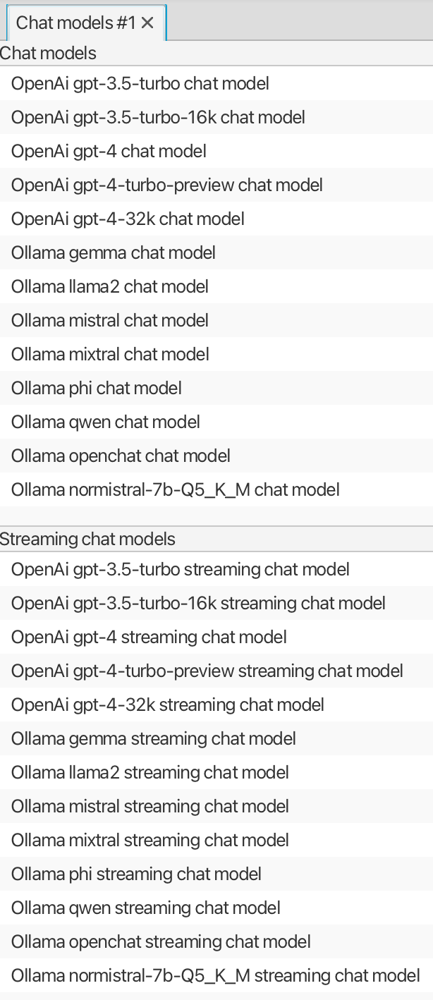
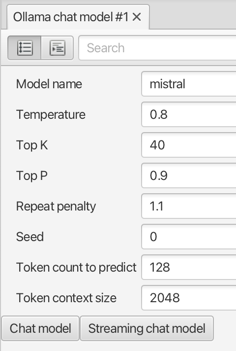
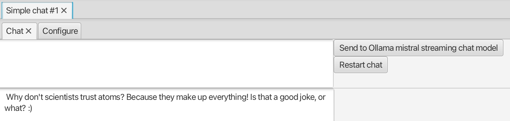
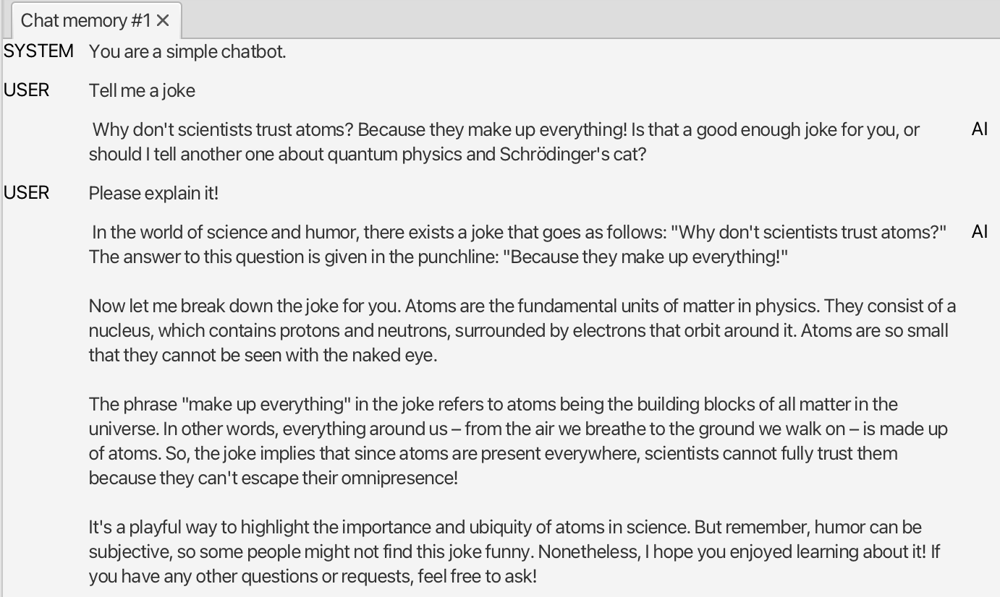
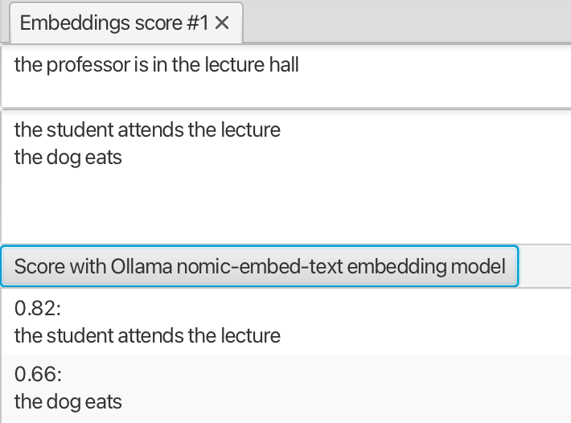
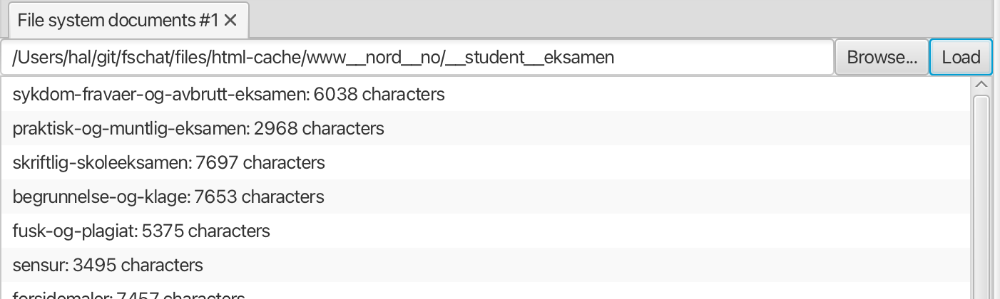
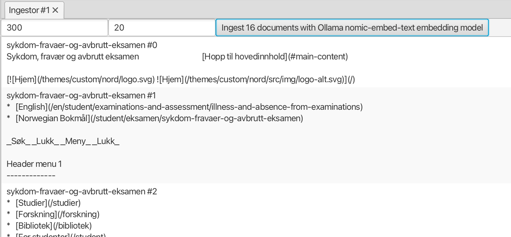
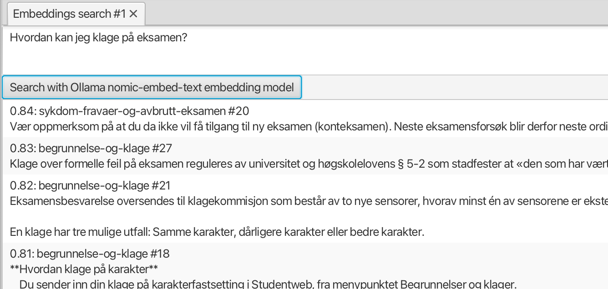
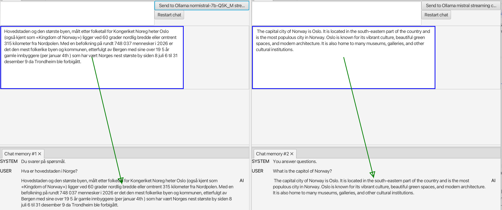

# Getting started with LLMs

This repo is for getting started with large language models (LLMs) using Langchain4J. It consists of two parts

1. a set of JBang 'scripts' that implement variants of pretty minimal chatbots
2. a workbench for trying out various components and techniques supported by Langchain4J, such as document 'ingestion', embeddings, chat language models and RAG

The scripts give a quick introduction to basic concepts as code, while the workbench allows playing around more interactively.

## Requirements

- [Install jbang](https://www.jbang.dev/documentation/guide/latest/installation.html), e.g. using sdkman.
    - If you're using VSCode, consider installing the [JBang extensions](https://github.com/jbangdev/jbang-vscode).
- Get access to LLM services, at least one of the following:
    - Install [ollama](https://ollama.com/), so you can run LLM services locally.
    - Register with an LLM service provider, like [openai](https://platform.openai.com/).

## JBang scripts

[JBang](https://www.jbang.dev/) allows creating and running fairly complex Java programs, without needing to setup a full project with a build system.
By adding build-oriented comments to ordinary Java classes, you can quickly pull in necessary dependencies and get started with minimal configuration hazzle.

Located in the [jbang folder](jbang/README.md), we have the following jbang-runnable scripts:

- [MinimalChat.java](jbang/MinimalChat.java) - a minimal console chatbot using an `OllamaChatModel` (which implements the `ChatLanguageModel` interface)
- [ChatWithMemory.java](jbang/ChatWithMemory.java) - a chatbot that uses a `ChatMemory` to keep track of the dialog (a sequence of `ChatMessage` alternating between `UserMessage` and `AiMessage`), so you can refer (implicitly or explicitly) to previous messages
- [ChatWithPrompt.java](jbang/ChatWithPrompt.java) - uses a `PromptTemplate` to give instructions for how to react to a user message and provide contextual information (today's date)
- [StreamingChat.java](jbang/StreamingChat.java) - uses a `StreamingChatLanguageModel` so responses are streamed as they are generated
- [AiServiceChat.java](jbang/AiServiceChat.java) - a different way of rigging a chatbot, by means of an `AiService` builder
- [RagChat.java](jbang/RagChat.java) - a chatbot implementing Retrieval Augmented Generation (RAG), by loading documents with`FileSystemDocumentLoader`, segmenting and storing them in an `EmbeddingStore` with an `EmbeddingStoreIngestor` and retrieving relevant segments and providing them as context with a `EmbeddingStoreContentRetriever`
- [QuarkusRagChat.java](jbang/QuarkusRagChat.java) - a chatbot implementing RAG rigged as a quarkus application and utilizating depencency injection

Running `jbang` on any of these will download dependencies, compile the source and run the `main` method.

## LLM Workbench

The workbench provides a set of *views* that allow you to explore various elements of Langchain4J.
Initially, there is one tab group, but tabs may be dragged and docked so you can get a layout suitable for your task.
Views may be *linked* so one may provide data to another, e.g.
the selected *embedding model* in the **Embedding models** may be used by the **Embeddings score** view, by linking them together.
When a view is opened, it is automatically linked to other views that provide data it needs, but you can link or unlink manually, if needed (see below).

### Views

The **View** menu has entries for each kind of view, select to create a new view.

#### Embedding models view
Lists all available embedding models, and the selection may be linked to views that need an embedding model.

#### Chat models view
Lists all available chat (language) models, with separate lists for ordinary and streaming ones.
The selection may be linked to views that need a chat model. Note that currently all chat views use the streaming variant, so select in the corresponding list.

#### Ollama chat model view
Create a new ollama (streaming) chat model with specific attributes. This allows to experiment with different settings, like temperature.
The view may be linked to views that need a chat model.

#### Simple chat view
Allows to chat with a (streaming) chat language model.
It shows the last answer, open and link to a **Chat memory** view to see the whole dialog.

#### Chat memory view
Shows the messages in a chat memory as a list. Link it to one of the chat views to have something to show.

#### Embeddings score view
Allows you to compute and compare (the similarity of) embeddings. The text in the upper text area, is compared to each of line of text in the lower text area. The view needs an embedding model, so you typically want to link it to the **Embedding models** view and select an embedding model there. 

#### File system documents view
Loads a set of HTML documents from a local folder, so they can be used as input for the **Ingestor** view.

#### Ingestor view
Splits a set of documents into text segments, computes embeddings and stores them in an embedding store.
The latter can be used as input for other view, e.g. **Embeddings search** and **Rag chat**.

#### Embeddings search view
Allows you to search an embedding store for text fragments similar to a sentence. The view needs an embedding store, so you typically want to link it to the **Ingestor** view.

The **Rag chat** view ...

Allows to chat with a (streaming) chat language model, and will use an embedding store, e.g. from a linked **Ingestor** view, to improve the answers.

### Linking views

Views may be linked, to pass data from one to another. E.g. since the **Embeddings score** view *needs* an embedding model,
it may be linked to the (selection in the) **Embedding models** view.

Actually, it's not the views that are linked, but interactive or visual elements, so an interactve element *providing* data may be linked to one *needing* the same kind of data.
In the mentioned case, the list in the **Embedding models** view *provides* an embedding model, and the score button in the **Embeddings score** view *needs* one.

When a view is created, the elements needing data are automatically linked to ones providing the corresponding kind of data. So if an **Embeddings score** view is
created while an **Embedding models** view is open, the appropriate link is also created. You can check this by pressing appropriate modifier keys (ALT+META);
green arrows will show which pairs of elements are linked. (They overlay may be a bit confusing, as arrows will also be shown for hidden elements).

When pressing these modifiers, possible source elements are highlighted in blue, and
if you press and drag with the mouse, and release above a valid target (highlighed in green) you can create a new link.
The remove a link, press the modifier keys and click on the link you want to remove.

In the image below, the chat response text field in two chat views are linked to respective **Chat memory** views.

