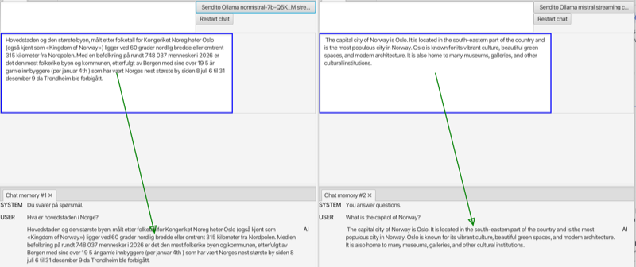

### Linking views

Views may be linked, to pass data from one to another. E.g. since the **Embeddings score** view *needs* an embedding model,
it may be linked to the (selection in the) **Embedding models** view.

Actually, it's not the views that are linked, but interactive or visual elements, so an interactve element *providing* data may be linked to one *needing* the same kind of data.
In the mentioned case, the list in the **Embedding models** view *provides* an embedding model, and the score button in the **Embeddings score** view *needs* one.

When a view is created, the elements needing data are automatically linked to ones providing the corresponding kind of data. So if an **Embeddings score** view is
created while an **Embedding models** view is open, the appropriate link is also created. You can check this by pressing appropriate modifier keys (ALT+META);
green arrows will show which pairs of elements are linked. (They overlay may be a bit confusing, as arrows will also be shown for hidden elements).

When pressing these modifiers, possible source elements are highlighted in blue, and
if you press and drag with the mouse, and release above a valid target (highlighed in green) you can create a new link.
The remove a link, press the modifier keys and click on the link you want to remove.

In the image below, the chat response text field in two chat views are linked to respective **Chat memory** views.

