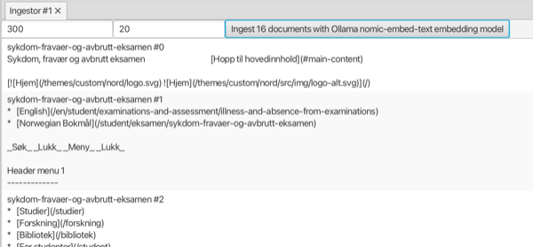

#### Ingestor view

Splits a set of documents into text segments, computes embeddings and stores them in an embedding store.
The latter can be used as input for other view, e.g. **Embeddings search** and **Rag chat**.

The view requires a set of documents and an embedding model from linked views.

