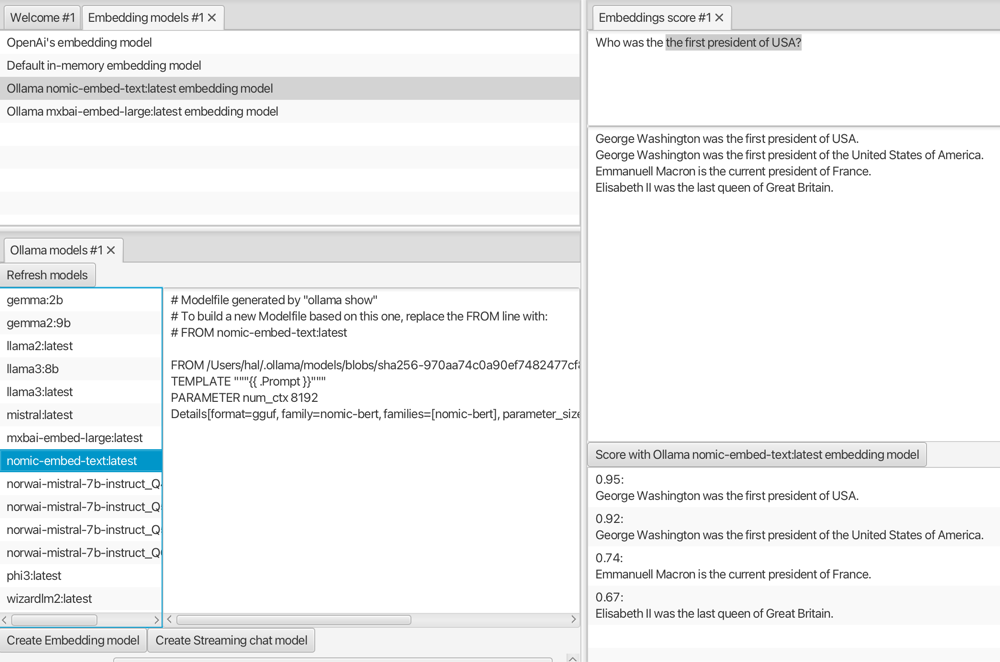
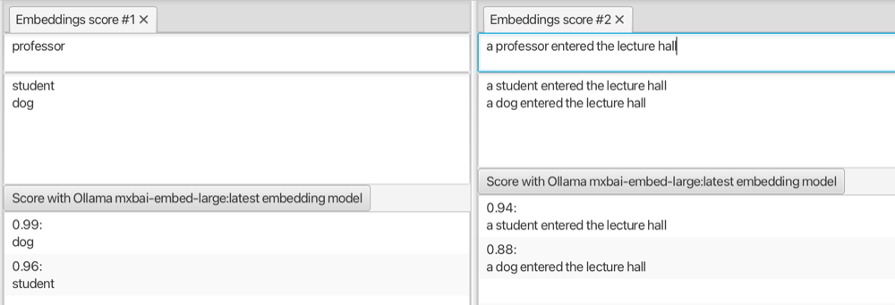
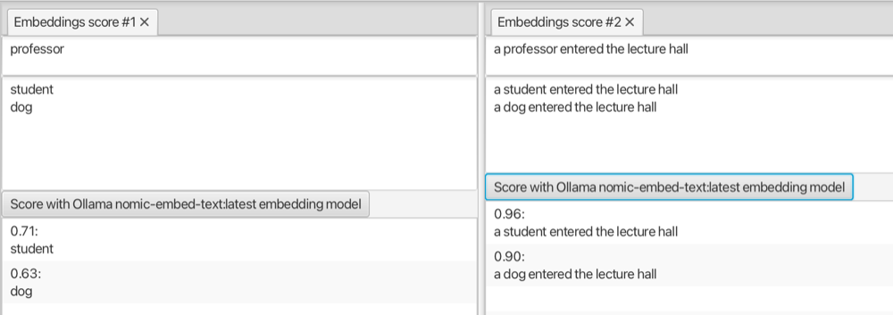
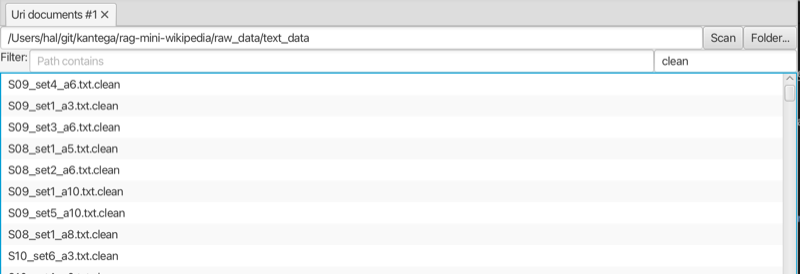
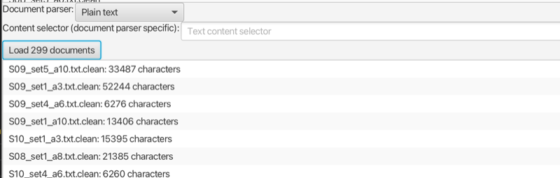
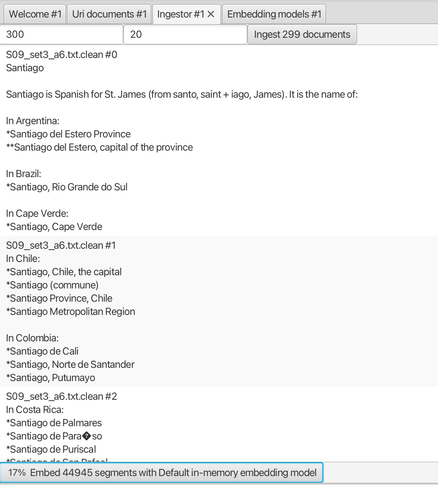

# Embeddings

A key part of large language models (LLMs) and Retrieval Augmented Generation (RAG) is how the meaning of text can be encoded as a vector of numbers, so-called embeddings.

## Connect to an embedding model

The [Embedding models view](no.kantega.llm.fx.EmbeddingModelsView:/markdown/views/no.kantega.llm.fx.EmbeddingModelsView.md) shows a list of available embedding models. It includes a default embedding model, a commonly used one from OpenAI, and you can also create (a connector to) one running on Ollama, as follows:

1. Download Ollama from their [download page](https://ollama.com/download), install and start it. Ollama runs in the background, and may be controlled by a Command Line Interface (CLI).
2. Download (pull) one or more of the available embedding models, e.g. `nomic-embed-text` with the command `ollama pull nomic-embed-text` (in the terminal).
3. Open the [Ollama models view](no.kantega.llm.fx.OllamaModelsView:/markdown/views/no.kantega.llm.fx.OllamaModelsView.md), where already pulled models are shown.
4. Select the one you want to use and click the **Create embedding model** button.
5. The newly created embedding model should now be shown in the [Embedding models view](no.kantega.llm.fx.EmbeddingModelsView:/markdown/views/no.kantega.llm.fx.EmbeddingModelsView.md).

After selecting an **EmbeddingModel** in the [Embedding models view](no.kantega.llm.fx.EmbeddingModelsView:/markdown/views/no.kantega.llm.fx.EmbeddingModelsView.md), you can try it out in the [Embeddings score view](no.kantega.llm.fx.EmbeddingsScoreView:/markdown/views/no.kantega.llm.fx.EmbeddingsScoreView.md).

## Embedding similarity

As mentioned, an embedding is a vector of numbers that (somehow) encodes the meaning of text (word, phrases or sentences). Text with similar meaning (content, topic, ...) will have embeddings that are similar. So how do you define vector similarity?

Several metrics for similarity have been suggested (and are in use):

* The *cosine* metric compare the *direction* of the embedding vectors by computing their dot product (sum of pair-wise products) divided by their lengths (normalization).

* The *geometric* or *euclidian distance* metric computing the distance between the end/tip of embeddings vectors (possibly normalizing the vectors first).

Metric values depend on the embedding model and the embedding model is the result of a complex machine learning process. Hence, you cannot in general assign meaning to specific (ranges of) values. E.g. saying that phrases with a similarity value above 0.9 means 'almost the same' or a that those with a value below 0.7 are 'not at all related', makes no sense. But given a *specific* embedding model, you can use such metrics for semantic search, i.e. find candidate text fragments that are most similar to a search phrase, and rank the results. You can also empirically set thresholds for determining which text fragments are 'almost the same' or 'not at all related'.

## The embeddings score view

To get a sense of the behavior of embeddings and metrics, the [Embeddings score view](no.kantega.llm.fx.EmbeddingsScoreView:/markdown/views/no.kantega.llm.fx.EmbeddingsScoreView.md) allows you to enter a *search* text fragment (words, phrases or sentences) and one or more *candidate* text fragments, and compute and rank the embeddings.

The search text is entered in the upper text area, while the candidates are entered as separate lines in the lower text area. The score button should indicate the active embedding model, and clicking it computes scores and sorts the results with the best matches first.

The screenshot below shows the [Embedding models view](no.kantega.llm.fx.EmbeddingModelsView:/markdown/views/no.kantega.llm.fx.EmbeddingModelsView.md) (top left), [Ollama models view](no.kantega.llm.fx.OllamaModelsView:/markdown/views/no.kantega.llm.fx.OllamaModelsView.md) (bottom left), and [Embeddings score view](no.kantega.llm.fx.EmbeddingsScoreView:/markdown/views/no.kantega.llm.fx.EmbeddingsScoreView.md) (right). The user has created several embedding models (running on Ollama), selected one, entered a search phrase and triggered computation of the scores.

The order of entries in the example above seems reasonable, but results may sometimes be surprising. Below you see two views comparing fragments with the words 'professor', 'student' and 'dog'. In the left case, where these words stand alone, 'dog' is more similar to 'professor' than 'student'. In the right case, where the same three words are part of the same phrase, the 'student' variant is most similar to the 'professor' variant.

This shows that trusting embeddings, particular for short fragments where words have little or no context, can be problematic. Note that the result above was particular for this specific embedding model, other embedding models gave the expected result, e.g. the one below.

While you cannot use the embedding model and similarity to find the answer to a question, you can find candidate text fragments that may contain the answer. This is the basis for the RAG technique, which is explored in the [RAG chat tutorial](rag-chat.md). But first, it may be better to explore embeddings further, by looking at how *documents* are fetched and split into fragments, and corresponding embeddings are computed.

## The URI documents view

The [URI documents view](no.kantega.llm.fx.UriDocumentsView:/markdown/views/no.kantega.llm.fx.UriDocumentsView) is used for locating and fetching document collections. The view consists of two parts.

In the upper part, you identify a document collection, either by entering an URI pointing to a sitemap.xml and clicking the **Scan**-button, or by selecting a local folder containing the documents. The list will be populated with the URIs or paths for the found documents. You can filter the list based on path content or file ending. Note that you can further limit the set of documents to fetch by manually selecting specific ones in the list.

In the screenshot below, the user has selected a local folder (containing a RAG dataset from huggingface) and filtered on the `clean` file extension.

In the lower part you select the document parser and possibly a selector for what part of the content should be extracted and parsed. Clicking the **Load** button will perform the actual fetching of the documents and parse them.

In the screenshot below, the user has selected the document parser for `Plain text` and loaded all the documents (from the list in the screenshot above).

The loaded documents are shown in a list, which can be used as input by views that need **Documents**, e.g. the [Ingestor view](no.kantega.llm.fx.IngestorView:/markdown/views/no.kantega.llm.fx.IngestorView).

## The ingestor view

The [Ingestor view](no.kantega.llm.fx.IngestorView:/markdown/views/no.kantega.llm.fx.IngestorView) takes an **EmbeddingModel** and a set of **Documents** as input, splits them into fragments and computes their embeddings.

The splitting part has two options, the maximum size of the fragments and the size of the overlap between fragments. After performing the splitting, you can review the result (and optionally select a subset of the fragments), befoire computing the embeddings. Note that computing embeddings may take some time.

In the screenshot below, the user has used the default options and split the 299 documents from the previous step into over 44945 fragments. The process of computing the embeddings has started and 17% of the fragments have been processed so far.

The embeddings may be used as input by views that need **TextSegmentEmbeddings**, e.g. the [Embeddings search view](no.kantega.llm.fx.EmbeddingsSearchView:/markdown/views/no.kantega.llm.fx.EmbeddingsSearchView.md) or the [Rag chat view](no.kantega.llm.fx.RagChatView:/markdown/views/no.kantega.llm.fx.RagChatView.md).

## The embeddings search view

The [Embeddings search view](no.kantega.llm.fx.EmbeddingsSearchView:/markdown/views/no.kantega.llm.fx.EmbeddingsSearchView.md) is similar to the [Embeddings score view](no.kantega.llm.fx.EmbeddingsScoreView:/markdown/views/no.kantega.llm.fx.EmbeddingsScoreView.md), in that it allows the user to search among and rank candidate fragments. But now the search is done among text fragments from document collections, instead from manually entered text, as provided by the [URI documents](no.kantega.llm.fx.UriDocumentsView:/markdown/views/no.kantega.llm.fx.UriDocumentsView) and [Ingestor](no.kantega.llm.fx.IngestorView:/markdown/views/no.kantega.llm.fx.IngestorView) views.
