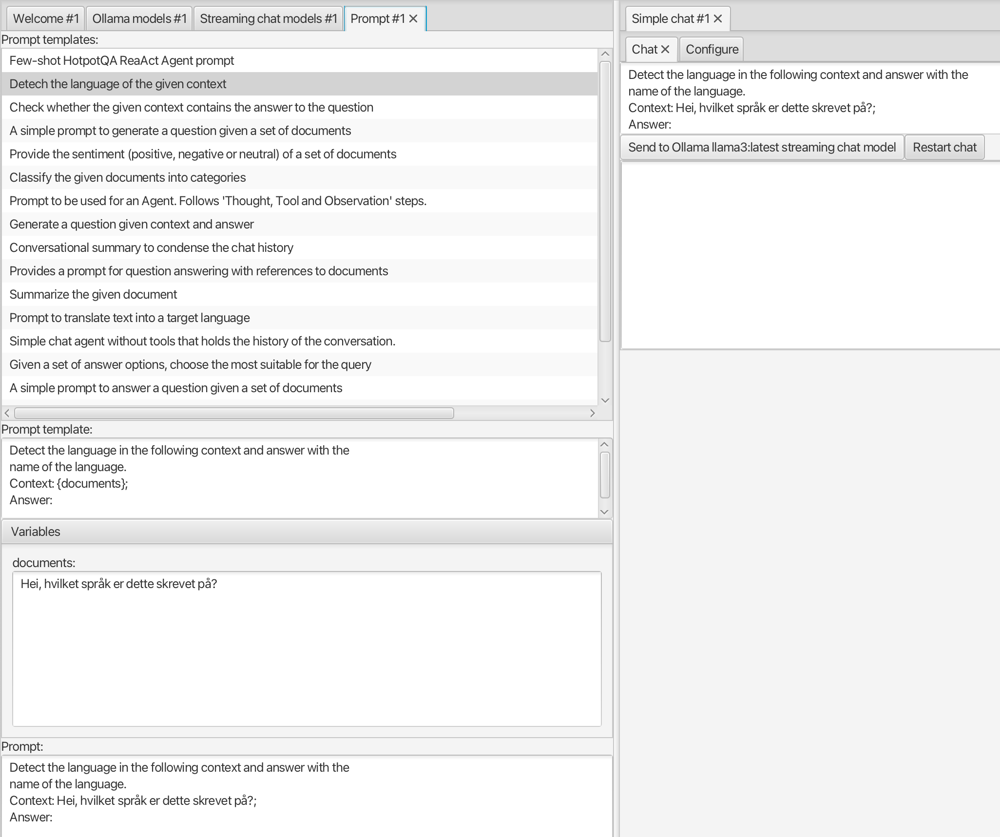

# Simple chat

A good place to start is the [Simple chat view](no.kantega.llm.fx.SimpleChatView:/markdown/views/no.kantega.llm.fx.SimpleChatView.md). To try it out, you'll need to get an LLM up and running, so you'll need to interact with a couple of other views first.

## Connect to an LLM

The [Streaming chat models view](no.kantega.llm.fx.StreamingChatLanguageModelsView:/markdown/views/no.kantega.llm.fx.StreamingChatLanguageModelsView.md) shows a list of available LLMs that support streaming responses (so the user doesn't have to wait for a complete one). If the list is empty, you'll need to create a (connector to a) new LLM first. The process depends in the source of the LLM, e.g. with [Ollama](https://ollama.com/), it is as follows:

1. Download Ollama from their [download page](https://ollama.com/download), install and start it. Ollama runs in the background, and may be controlled by a Command Line Interface (CLI).
3. Download (pull) one or more of the available LLMs, e.g. `llama3` with the command `ollama pull llama3` (in the terminal).
4. Open the [Ollama models view](no.kantega.llm.fx.OllamaModelsView:/markdown/views/no.kantega.llm.fx.OllamaModelsView.md), where already pulled models are shown.
5. Select the one you want to use and click the **Create streaming chat model** button.
6. The newly created LLM (connector) should now be shown in the [Streaming chat model view](no.kantega.llm.fx.StreamingChatLanguageModelsView:/markdown/views/no.kantega.llm.fx.StreamingChatLanguageModelsView.md)

If you'd rather use an OpenAI model, you need to sign up at their site, get an API key, create a `.env`file with the key, before (re)starting. Then the process is similar to steps 3-5, using the [OpenAI chat models view](no.kantega.llm.fx.OpenaiChatModelsView:/markdown/views/no.kantega.llm.fx.OpenaiChatModelsView.md).

After selecting a **StreamingChatLanguageModel** in the [Streaming chat models view](no.kantega.llm.fx.StreamingChatLanguageModelsView:/markdown/views/no.kantega.llm.fx.StreamingChatLanguageModelsView.md), you can open the [Simple chat view](no.kantega.llm.fx.SimpleChatView:/markdown/views/no.kantega.llm.fx.SimpleChatView.md). There you can enter a text and send it to the LLM. The button text should indicate the active LLM, and if you select another one it should update accordingly.

## Prompting

Key to utilizing an LLM for different tasks (besides chatting) is creating useful prompts that (somehow) taps into the power of the model.
E.g. you may have an email that you want to classify into topics. By providing the LLM with the contents of the email and a list of possible topics,
it can then return which topic is most likely.

The [Prompt view](no.kantega.llm.fx.PromptView:/markdown/views/no.kantega.llm.fx.PromptView.md) allows you to create task specific prompts based on templates.
If you open it, select and edit the prompt template and/or prompt, the [Simple chat view](no.kantega.llm.fx.SimpleChatView:/markdown/views/no.kantega.llm.fx.SimpleChatView.md)
will pick up the resulting prompt so you can easily send it to the LLM.

In the screenshot below, the user has selected a template for detecting the language of text content, given by the **documents** variable.
The text field for the **documents** variable has been filled with a Norwegian sentence, and
the resulting prompt (at the bottom) has been picked up by the [Simple chat view](no.kantega.llm.fx.SimpleChatView:/markdown/views/no.kantega.llm.fx.SimpleChatView.md).
It can now be sent to the LLM to see if it detects it correctly.

## The chat memory

The [Simple chat view](no.kantega.llm.fx.SimpleChatView:/markdown/views/no.kantega.llm.fx.SimpleChatView.md) shows only the last answer from the LLM. To the see the full *chat history* open the [Chat memory view](no.kantega.llm.fx.ChatMemoryView:/markdown/views/no.kantega.llm.fx.ChatMemoryView.md).

*Chat memory* is a technical term for where the chat history, i.e. sequence of *chat messages*, is stored. Each chat message has one of several *roles* depending on where it originated:

* A *system* message (often called system *prompt*) contains the general instructions for how the LLM should behave, e.g. answer questions, be helpful and polite etc. The chat memory is initialized with this kind of message when the chat is (re)started.
* A *user* message contains the user's request, and may be a *modified* version of what the user actually typed.
* An *AI* message is the LLM's response.

Thus, the chat history starts with a system message and then contains alternating user and AI messages.

The [Simple chat view](no.kantega.llm.fx.SimpleChatView:/markdown/views/no.kantega.llm.fx.SimpleChatView.md), has a **Configure** tab where you can change the system prompt. Play with it to see how it affects the LLM's response!

The screenshot below shows the [Streaming chat models view](no.kantega.llm.fx.StreamingChatLanguageModelsView:/markdown/views/no.kantega.llm.fx.StreamingChatLanguageModelsView.md) (top left), [Ollama models view](no.kantega.llm.fx.OllamaModelsView:/markdown/views/no.kantega.llm.fx.OllamaModelsView.md) (bottom left), [Simple chat view](no.kantega.llm.fx.SimpleChatView:/markdown/views/no.kantega.llm.fx.SimpleChatView.md) (top right) and [Chat memory view](no.kantega.llm.fx.ChatMemoryView:/markdown/views/no.kantega.llm.fx.ChatMemoryView.md) (bottom right). The user has created a **llama3** model (running on Ollama), asked it to tell a joke (user message) and received the response (AI message).

An LLM is actually *stateless*, i.e. it doesn't store anything about a chat dialog across requests, so the whole chat memory content is in fact sent in each request to the LLM.

The chat memory will grow for each request and response, and to avoid overwhelming the LLM, the oldest user and AI message may be removed. The initial system prompt is kept, to retain the overall LLM behavior. If you restart the chat, the chat memory is cleared and reinitialized with the system prompt.

## More detail, please...

The above is generally enough to understand how to use LLMs with LangChain4J. However, some more detail can be helpful when configuring LLMs or working with custom ones. 

### Neural network inference

An LLM is a *neural network* consisting of many connected *layers*. The network as a whole takes some *input* and computes some *output* as a *function* of the structure of connected layers, interal network *parameters* and the input. The structure is determined in advance, the parameters are determined during training and the input is provided in each request. The overall computation is performed as a series of matrix operations and is often called *inference*.

### Tokenization

When the sequence of chat messages is received in a request, it needs to be translated to the actual network input, before running the inference. The details depend on the specific LLM, but the process is typically the following:

The sequence of messages is converted into a sequence of so-called *tokens*. First, you apply a *chat template* to convert the messages into a text format corresponding to how the LLM was trained. Then that text is *tokenized* giving the resulting tokens (see illustration below, from https://cameronrwolfe.substack.com/p/language-model-training-and-inference).

A token is a number that may correspond to a whole word, a sub-word or an individual character. Some tokens are special characters or markers, like end-of-sentence. In general, you can think of tokens as the smallest semantic unit of text.

The number is used as an index into an *embedding* table, where each embedding is a vector of numbers, that somehow captures the meaning of that token. It's these embeddings that are the actual input to the neural network, from which the output is derived. During the inference process, the embeddings of each token from the chat messages sequence are combined in a way that assigns them more specific meaning than the initial embeddings.

The output of the network is *not* the LLM's response, i.e. an AI message, it is the *first/next token* of this message. Or rather, it is a set of *possible* tokens and the *probability* that it is the "best" one. By selecting one and feeding it back into a new round of inference, a stream of tokens is generated.

### Generation parameters

Details of this process is affected by some extra *generation* parameter (besides the chat messages). Varying these parameters, you can make the LLM generate more or less likely responses. The LLM comes with sensible defaults, but you can configure an LLM (connector) to use other values. Both the [Ollama models view](no.kantega.llm.fx.OllamaModelsView:/markdown/views/no.kantega.llm.fx.OllamaModelsView.md) and the [OpenAI chat models view](no.kantega.llm.fx.OpenaiChatModelsView:/markdown/views/no.kantega.llm.fx.OpenaiChatModelsView.md) contain a lower part where you can edit these generation parameters and create a new LLM with non-default one.
