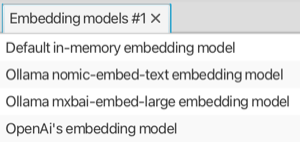

#### Embedding models view

Lists all available embedding models. The selection may be linked to views that need an embedding model (see [linking views](linking-views.md)).

The list is prepopulated with a couple of embedding models, but more can be created in specific views,
like the [Ollama models view](no.kantega.llm.fx.OllamaModelsView:/views/no.kantega.llm.fx.OllamaModelsView.md).

