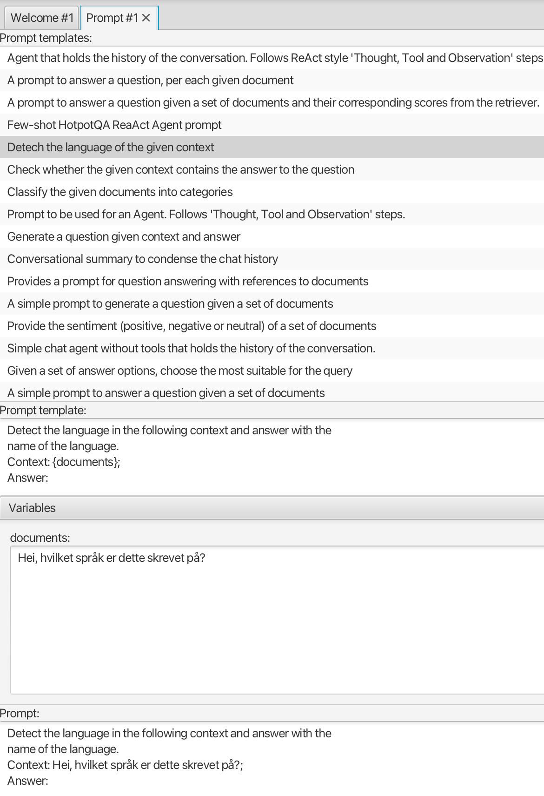

#### Prompt view
This  view allows creating prompts, i.e. input to LLMs using *prompt templates*.
A prompt template contains text with variable placeholders, that you fill in by providing values for the variables.
This is useful for customizing prompts for specific tasks, like sentiment classification or language detection.

The view is preloaded with a list of templates from https://prompthub.deepset.ai/, which covers a wide range of tasks.
Selecting one of them will fill the prompt template text area with the corresponding template text, so you can edit it.
Whenever the prompt template changes, fields for editing variable values are automatically created.
When these are edited, the resulting prompt at the bottom of the view is updated.

The prompt may be linked to the **Simple chat** view, so you can try various prompts in a chat with an LLM.

Many of the templates contain a *documents* variable, which correspond to a set of text fragments like those provided by the **Ingestor** view.
The **Ingestor** view supports copying the contents of the selected (or all) text fragments, so you can more easily fill in the *documents* variable.

