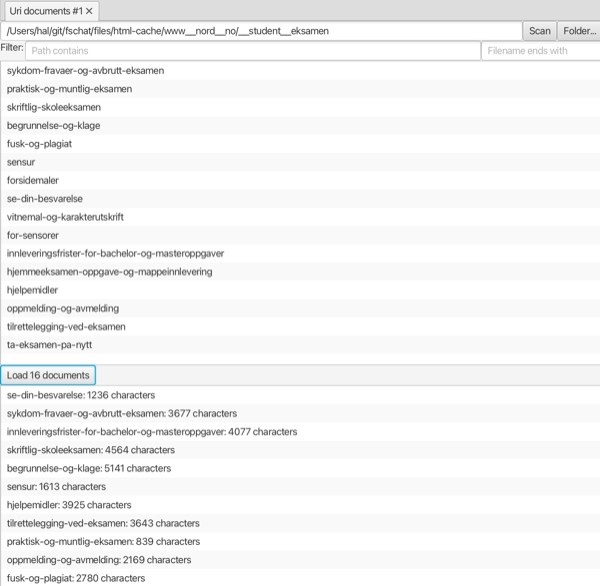

#### Uri documents view

Loads a set of HTML documents from a site or a local folder, so they can be used as input for the **Ingestor** view.

To load a set of documents, first enter a URL for a sitemap, e.g. https://ntnu.no/sitemap.xml, and select the **Scan** button, or locate a folder in the local file system. Use the two filter fields to limit the set of documents.

Then use the **Load** button, to (fetch and) load the documents.

