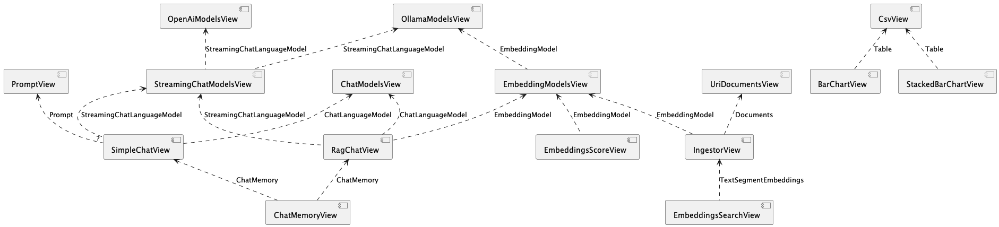

### Views

The **View** menu has entries for each kind of view, organized by category. Select an entry to create a new view.

Here are all the available views:

* [Welcome view](no.kantega.llm.fx.WelcomeView.md)

* [Embedding models view](no.kantega.llm.fx.EmbeddingModelsView.md) - lists all available embedding models

* [Chat models view](no.kantega.llm.fx.ChatLanguageModelView.md) - lists all available chat models

* [Streaming chat models view](no.kantega.llm.fx.StreamingChatLanguageModelView.md) - lists all available streaming chat models

* [Ollama models view](no.kantega.llm.fx.OllamaModelsView:/markdown/views/no.kantega.llm.fx.OllamaModelsView.md) - create new ollama chat models

* [OpenAi models view](no.kantega.llm.fx.OpenaiChatModelsView:/markdown/views/no.kantega.llm.fx.OpenaiChatModelsView.md) - create new open ai chat models

* [Hugging face models view](no.kantega.llm.fx.HuggingfaceModelView:/markdown/views/no.kantega.llm.fx.HuggingfaceModelView.md) - create new hugging face chat models

* [Simple chat view](no.kantega.llm.fx.SimpleChatView.md) - chat with a (streaming) chat model

* [Chat memory view](no.kantega.llm.fx.ChatMemoryView.md) - shows the messages in a chat memory

* [Embeddings score view](no.kantega.llm.fx.EmbeddingsScoreView.md) - compute and compare (the similarity of) embeddings

* [Uri documents view](no.kantega.llm.fx.UriDocumentsView.md) - load documents, to use as input for the **Ingestor** view

* [Ingestor view](no.kantega.llm.fx.IngestorView.md) - split documents into text segments and compute their embeddings

* [Embeddings search view](no.kantega.llm.fx.EmbeddingsSearchView.md) - search embeddings for text fragments similar to a sentence

* [Rag chat view](no.kantega.llm.fx.RagChatView.md) - chat with a chat model, using RAG to provide answers

* [Csv view](no.kantega.llm.fx.CsvView.md) - load and view csv data

* [Bar chart view](no.kantega.llm.fx.BarChartView.md) - view table data as bar chart

* [Stacked bar chart view](no.kantega.llm.fx.StackedBarChartView.md) - view table data as stacked bar chart

* [Expression view](no.kantega.llm.fx.ExpressionView.md) - evaluate expressions

### Dependencies

Views may *provide* data to other views, alternatively a view my *require* data from other views. E.g. the [Embedding models view](no.kantega.llm.fx.EmbeddingModelsView.md) allows the user to select an **EmbeddingModel** from a lists, and this **EmbeddingModel** is made available or *provided* to other views. The [Embeddings score view](no.kantega.llm.fx.EmbeddingsScoreView.md) on the other hand, *requires* an **EmbeddingModel**, and by linking it to the [Embedding models view](no.kantega.llm.fx.EmbeddingModelsView.md), it will use the selected one. We can say there's a provide/require-*dependency* among these two views.

The following diagram illustrates the provide/require-relationsships among the above views.

