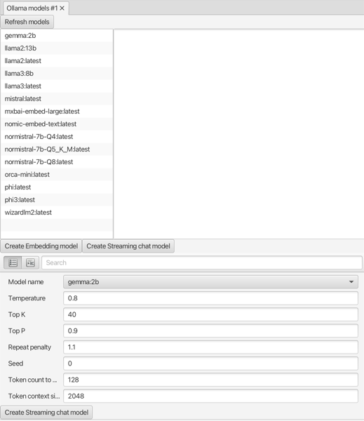

#### Ollama models view

Create a new streaming chat model available on an Ollama service. You can either create one with default settings, or you can use the property sheet to control the various options, like temperature.

Created models will appear in the corresponding model view, e.g. **Streaming chat model view**.

